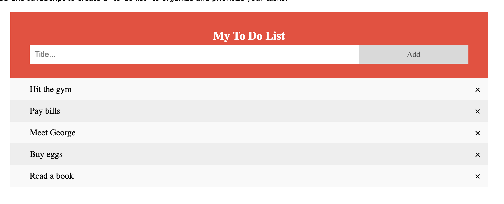

***BELAJAR ATM***
ATM (amati, tiru, modifikasi) adalah teknik yang sangat dibutuhkan juga bagi programmer, disini kalian akan mencontoh salah satu simple website interaktif yaitu To Do List dari resource W3 School.

[w3school todolist app](https://www.w3schools.com/howto/howto_js_todolist.asp)

TASK :
- Tiru Website Todo Listnya
- Explore Dom lain dan tambahkan Fitur (Searching)
- Push htmlnya di github kalian yang phase 0
